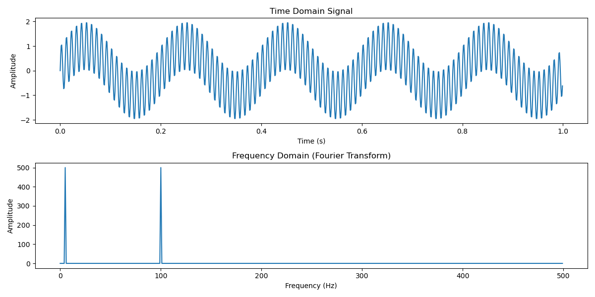

# Chapter 3: Fourier Transform and Frequency Domain Analysis

Welcome to Chapter 3! In this chapter, we explore one of the most powerful tools in signal processing: the Fourier Transform. You’ll learn how to analyze the frequency content of signals, which is essential for tasks such as filtering, modulation, and feature extraction.

---

## 3.1 Overview

In this chapter, we will cover:
- **Fourier Series Basics:** A brief look at how periodic signals can be represented as sums of sine and cosine functions.
- **The Fourier Transform:** Understanding how any signal can be decomposed into its constituent frequencies.
- **Discrete Fourier Transform (DFT) & Fast Fourier Transform (FFT):** Techniques to compute the Fourier Transform efficiently for digital signals.
- **Properties and Applications:** Key properties of the Fourier Transform and practical examples in Python.
- **Interactive Examples and Exercises:** Hands-on activities to solidify your understanding.

---

## 3.2 Fourier Series Recap

For periodic signals, the **Fourier Series** allows us to express the signal as a sum of sines and cosines:
$$x(t) = \sum_{n=-\infty}^{\infty} c_n \, e^{j 2\pi n f_0 t}$$
where:
- $f_0$ is the fundamental frequency.
- $c_n$ are the Fourier coefficients.

This representation highlights that a periodic signal can be thought of as being built from a set of discrete frequency components.

---

## 3.3 The Fourier Transform

For non-periodic or aperiodic signals, we use the **Fourier Transform (FT)**:
$$X(f) = \int_{-\infty}^{\infty} x(t) \, e^{-j 2\pi f t} \, dt$$
and the inverse Fourier Transform is given by:
$$x(t) = \int_{-\infty}^{\infty} X(f) \, e^{j 2\pi f t} \, df$$

**Key Points:**
- The Fourier Transform converts a time-domain signal $(x(t))$ into its frequency-domain representation $(X(f))$.
- It reveals the amplitude and phase of the different frequency components present in the signal.
- The transform is linear and has several useful properties (e.g., time-shift, frequency-shift, convolution).

### Time and Frequency Domain Representation

A fundamental concept in signal processing is the transformation between the time domain and the frequency domain. This transformation is achieved using the **Fourier Transform**, which decomposes a signal into its constituent frequency components.

### Time Domain Signal
The plot below shows a modulated sinusoidal waveform in the time domain. This type of signal occurs in applications such as:
- Amplitude Modulation (AM) in communication systems.
- Beat frequency generation in physics and audio processing.

### Frequency Domain Analysis
The **Fourier Transform** of this signal is shown in the lower plot. It reveals two distinct frequency components, confirming that the time-domain signal is composed of two sinusoidal waves of different frequencies.

**Figure 2**: The top plot shows a modulated sinusoidal waveform in the time domain, which consists of two different frequency components. The bottom plot represents its **Fourier Transform**, revealing two distinct frequency peaks corresponding to the sinusoidal components of the signal. This visualization highlights the importance of Fourier analysis in signal processing, where complex signals can be decomposed into their fundamental frequencies.

This demonstrates how Fourier analysis allows us to extract frequency information from a complex signal, making it an essential tool in digital signal processing (DSP).

## 3.4 Discrete Fourier Transform (DFT) and FFT

Since real-world signals are often digital (discrete in time), we use the **Discrete Fourier Transform (DFT)**:
$$X[k] = \sum_{n=0}^{N-1} x[n] \, e^{-j \frac{2\pi}{N} k n}, \quad k = 0, 1, \dots, N-1$$
where:
- $$x[n]$$ is the discrete signal.
- $$N$$ is the number of samples.

The **Fast Fourier Transform (FFT)** is an efficient algorithm to compute the DFT.

**Interactive Example:**
View [2_visualizing_fourier_transform.py](./examples/2_visualizing_fourier_transform.py) to see how two sine waves are decomposed into their frequency components using the FFT.

---

## 3.5 Applications of Fourier Analysis

Fourier analysis is a cornerstone in many signal processing applications:
- **Filtering:** Isolate or remove frequency bands (e.g., noise reduction).
- **Modulation and Demodulation:** In communications, signals are often modulated by shifting frequency components.
- **Feature Extraction:** In audio processing, identifying key frequencies helps in tasks like speech recognition or music analysis.

**Practical Example:**
Imagine you have a composite signal made of two sine waves (e.g., 5 Hz and 100 Hz). The Fourier Transform allows you to visualize the two distinct frequency components. This insight is invaluable for designing filters and understanding signal behavior.

---

## 3.6 Interactive Exploration

Throughout this chapter, we encourage you to interact with the provided examples:
- **Visualize the Spectrum:** Use Python scripts to compute the FFT of a signal and plot its frequency spectrum.
- **Experiment with Signal Composition:** Create your own composite signals by combining sine waves with different frequencies and amplitudes, then analyze their spectra.
- **Explore FFT Properties:** Modify parameters such as sampling frequency and window length to see how they affect the frequency resolution and leakage.

---

## 3.7 Exercises

To deepen your understanding, try these exercises:

1. **Spectrum Analysis:**
   - Generate a composite signal with at least two sine waves of different frequencies.
   - Compute its Fourier Transform using the FFT.
   - Plot the magnitude spectrum and identify the peaks corresponding to the sine waves.

2. **Effect of Sampling Frequency:**
   - Simulate a signal and compute its FFT with different sampling rates.
   - Analyze how the frequency resolution changes as you vary the sampling frequency.

3. **Fourier Transform Properties:**
   - Explore the effect of a time shift on the Fourier Transform.
   - Investigate the linearity property by computing the FFT of a sum of signals and comparing it with the sum of their individual FFTs.

---

## 3.8 Summary

In this chapter, you learned:
- How the Fourier Transform decomposes a signal into its frequency components.
- The fundamental differences between the Fourier Series, FT, and DFT.
- The significance of the FFT in efficiently computing the frequency spectrum of digital signals.
- Practical applications of Fourier analysis in filtering, communications, and feature extraction.

Armed with these concepts, you are now ready to delve deeper into signal processing techniques. In the next chapter, we will explore **Simulating and Analyzing EEG Signals**, where these frequency-domain techniques will be applied to real-world biomedical signals.